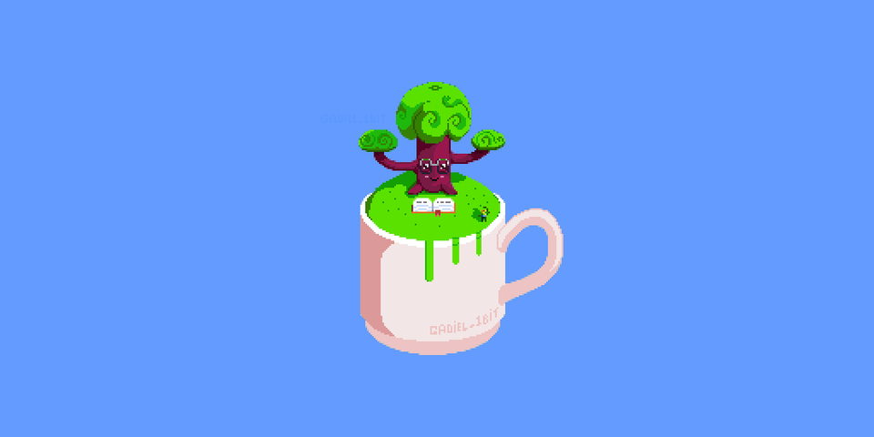

## ✨ Hi, My Name is Gadiel and i'm making some games. ✨

- 🔭 I’m currently working on my tiny projects like [Cursed-House-Nightmare](https://github.com/GAAADHE/Cursed-House-Nightmare), using [Godot engine](https://github.com/godotengine/godot).

- ❔ Pronouns: He/Him

- 🖥️ SO
    - Linux Manjaro
    - Linux Mate
    - Windows

- 🧰 Some main tool list that I use
    - [Aseprite](https://www.aseprite.org/) for pixel art. (paid)
    - [Krita](https://krita.org/en/) for digital painting. (free)
    - [Blender](https://www.blender.org/) for 3D models, Animation, etc. (free)
    - [Inkscape](https://inkscape.org/) for vectors images. (free)

| Languages        | Expertise (1 to 5) |
|:-------------  |:-----:|
| Javascript     | ⭐⭐⭐⭐ |
| HTML5/CSS      | ⭐⭐⭐⭐ |
| Node           | ⭐⭐⭐ |
| Python         | ⭐⭐  |
| PHP            | ⭐⭐  |
| C/CPP          | ⭐    |
| C#             | ⭐    |
| Java           | ⭐    |

 
- 💬 Ask me something on twitter [@GAAADHE](https://twitter.com/gaaadhe)

- 🐸 Fun fact: I love green florests and capybaras

<!--
**GAAADHE/GAAADHE** is a  _special_ ✨ repository because its `README.md` (this file) appears on your GitHub profile.

-->
